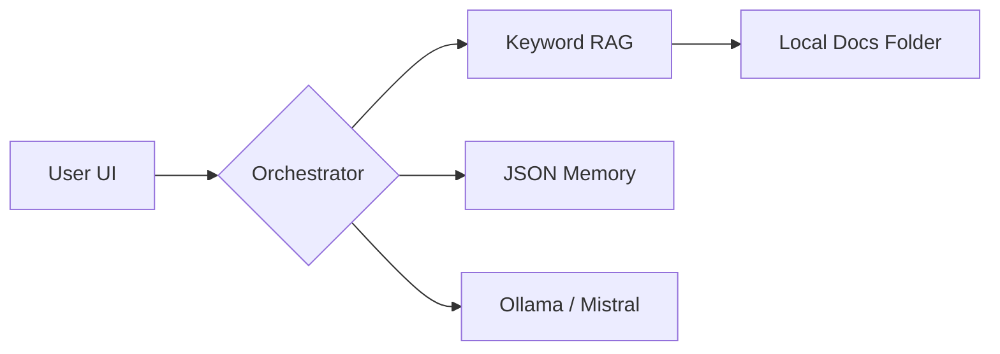

# 🧠 PrivateMind: Personal Offline AI Assistant

A **local, privacy-first AI ecosystem** built to turn your personal notes into an interactive knowledge base. No cloud, no subscription, no data leaks.

Built with **Ollama + Mistral + Python**, PrivateMind is designed for students and researchers who need a powerful research assistant that runs entirely on their own hardware.

---

## 💡 Why PrivateMind?

Most AI assistants act as a "black box" that sends your data to third-party servers. I built this project to deconstruct the **LLM Orchestration layer** and understand:

* How **Retrieval-Augmented Generation (RAG)** works without expensive vector databases.
* How to manage **asynchronous UI threading** in Python.
* How to implement **explicit memory systems** that respect user consent.

---

## ✨ Key Features

| Feature | Description |
| --- | --- |
| 🔒 **Total Privacy** | 100% Offline. Zero telemetry. Zero API calls. |
| 📚 **Contextual RAG** | Indexes your `PDF`, `TXT`, and `MD` files for instant Q&A. |
| 🧠 **Opt-in Memory** | Persistent `JSON` memory that only saves what you explicitly approve. |
| 📅  **Study Planner** | Algorithmic breakdown of focus areas into realistic daily tasks. |
| ⚡ **CPU Optimized** | Lightweight keyword-based retrieval designed for laptops without dedicated GPUs. |
| 🖥️ **Native UI** | Clean, responsive Desktop interface built with Tkinter. |

---

## 🏗️ Architecture Overview

The system follows a modular design to separate the "brain" (LLM) from the "eyes" (RAG) and the "hands" (UI).



* **Inference Engine:** [Ollama](https://ollama.com/) running Mistral-7B.
* **Retrieval Logic:** Custom keyword-matching algorithm to ensure low latency on standard CPUs.
* **State Management:** Threaded Python logic to prevent UI freezing during LLM generation.

---

## 🚀 Getting Started

### ✅ Prerequisites

* **Python 3.10+**
* **Ollama Desktop** ([Download here](https://ollama.com/download))

### 1️⃣ Installation

```bash
# Clone the repository
git clone https://github.com/YOUR_USERNAME/personal-ai-assistant.git
cd personal-ai-assistant

# Install dependencies
pip install -r requirements.txt

```

### 2️⃣ Model Setup

Ensure Ollama is running in your tray, then pull the model:

```bash
ollama pull mistral

```

### 3️⃣ Load Your Knowledge

Move your study materials into the `ai_docs/` folder.

```bash
cp ~/Downloads/os_notes.pdf ./ai_docs/

```

### 4️⃣ Launch

```bash
python ui.py

```

---

## 🧪 Interactive Examples

| Goal | What to Type |
| --- | --- |
| **Query Docs** | "Based on my notes, what are the layers of the OSI model?" |
| **Set Memory** | "Remember that my final exam is on December 12th." |
| **Retrieve Memory** | "What do you know about my upcoming schedule?" |
| **Plan Study** | "Create a 3-day study plan for Computer Networks." |

---

## 🧠 Learning Outcomes

This project served as a deep dive into **LLM System Design**:

* **RAG Pipeline:** Implemented document parsing and text chunking from scratch.
* **Memory Persistence:** Developed a logic gate to distinguish between "chat history" (volatile) and "knowledge memory" (persistent).
* **Concurrency:** Used Python's `threading` and `queue` modules to manage real-time text streaming in a GUI.

---

## 📌 Roadmap & Future Enhancements

* [ ] **Semantic Search:** Implementing `Sentence-Transformers` for better context matching.
* [ ] **OCR Engine:** Adding `Tesseract` support to read scanned images/notes.
* [ ] **Model Hot-Swapping:** A dropdown to switch between Llama3, Phi-3, and Mistral.
* [ ] **Dark Mode:** Modernizing the Tkinter interface with custom themes.

---

## 👤 Author

**Abhay**

* *Computer Engineering Student*
* **Interests:** AI Systems, Data Engineering, LLM Architectures
